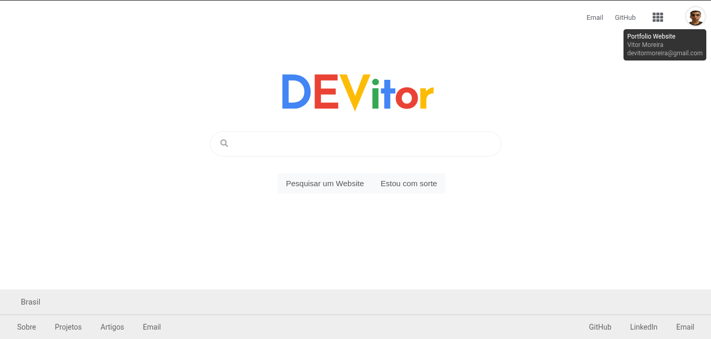
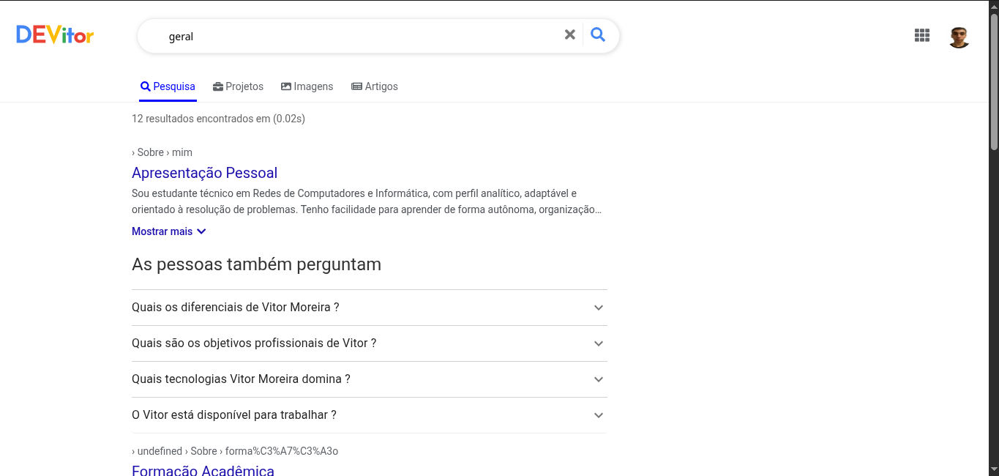

# 🌐 DEVitor's Portfolio

Um portfólio pessoal inspirado na interface de busca do Google. Desenvolvido com
foco em design minimalista, performance e responsividade. Esse projeto apresenta
meus trabalhos, experiências e habilidades de forma intuitiva e moderna.

<br/>

## 🔎 Prévia Online

Acesse aqui: [https://seu-link.vercel.app](https://seu-link.vercel.app)

<br/>

## 🖼️ Imagens do Projeto

### Tela Inicial

> 

### Página de Resultados

> 

<br/>

## 🛠️ Tecnologias Utilizadas

- **JavaScript (ES6+)**
- **React 17**
- **React Router DOM**
- **Material UI**
- **Framer Motion**
- **React Select**
- **FontAwesome**
- **CSS3**
- **Babel**
- **NPM**
- **EditorConfig**
- **Prettier + ESLint**
- **GitHub Actions (CI)**

<br/>

## ⚙️ Scripts disponíveis

```bash
npm start           # Inicia o projeto em modo de desenvolvimento
npm run build       # Gera a versão de produção
npm run deploy      # Publica no GitHub Pages (após build)
```
